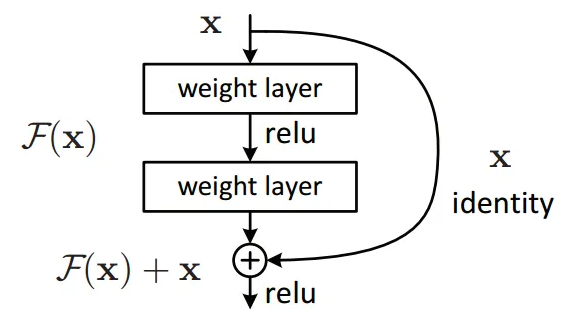
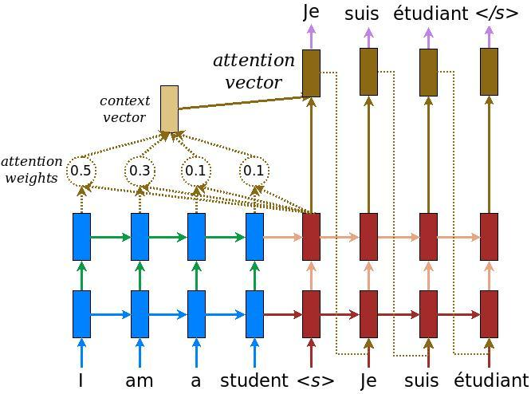

# NanoGPT
This repository, which is based on this [tutorial](https://www.youtube.com/watch?v=kCc8FmEb1nY), uses the Shakespeare dataset.

Code is available in this [link](https://github.com/karpathy/nanoGPT)

which first builds a simple model and then uses some ideas that are very famous in the field of deep learning to get less error.

which generally includes drop out, attention and residual block.

### Residual block ###

We know neural networks are universal function approximators and that the accuracy increases with increasing the number of layers. But there is a limit to the number of layers added that results in an accuracy improvement. So, if neural networks were universal function approximators, then they should have been able to learn any simplex or complex function. But it turns out that, thanks to some problems like vanishing gradients and the curse of dimensionality, if we have sufficiently deep networks, it may not be able to learn simple functions like an identity function. Now, this is clearly undesirable.

The idea is that instead of letting layers learn the underlying mapping, let the network fit the residual mapping. So, instead of say H(x), initial mapping, let the network fit, F(x) := H(x)-x which gives H(x) := F(x) + x

The approach is to add a shortcut or a skip connection that allows information to flow, well just say, more easily from one layer to the next’s next layer, i.e., you bypass data along with normal CNN flow from one layer to the next layer after the immediate next.

Therefore, by adding new layers, because of the “Skip connection” / “residual connection”, it is guaranteed that performance of the model does not decrease, but it could increase slightly.

### Dropout ###

Dropout layers have been the go-to method to reduce the overfitting of neural networks. It is the underworld king of regularisation in the modern era of deep learning.

Dropout is a regularization method that approximates training a large number of neural networks with different architectures in parallel.

During training, some number of layer outputs are randomly ignored or “dropped out.” This has the effect of making the layer look-like and be treated-like a layer with a different number of nodes and connectivity to the prior layer. In effect, each update to a layer during training is performed with a different “view” of the configured layer.

### Attention ###

Attention is simply a vector, often the outputs of dense layer using softmax function.

Before Attention mechanism, translation relies on reading a complete sentence and compress all information into a fixed-length vector, as you can image, a sentence with hundreds of words represented by several words will surely lead to information loss, inadequate translation, etc.

However, attention partially fixes this problem. It allows machine translator to look over all the information the original sentence holds, then generate the proper word according to current word it works on and the context. It can even allow translator to zoom in or out (focus on local or global features).

Similar to the basic encoder-decoder architecture,(in the nanoGPT we don't implement encoder part) this fancy mechanism plug a context vector into the gap between encoder and decoder. According to the schematic above, blue represents encoder and red represents decoder; and we could see that context vector takes all cells’ outputs as input to compute the probability distribution of source language words for each single word decoder wants to generate. By utilizing this mechanism, it is possible for decoder to capture somewhat global information rather than solely to infer based on one hidden state.